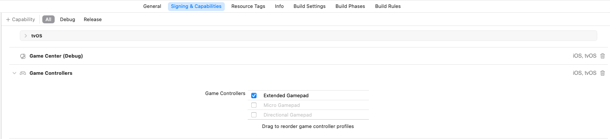
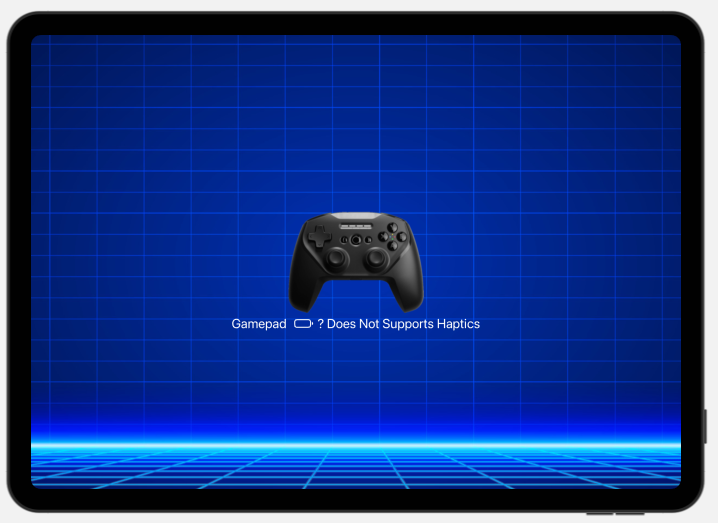
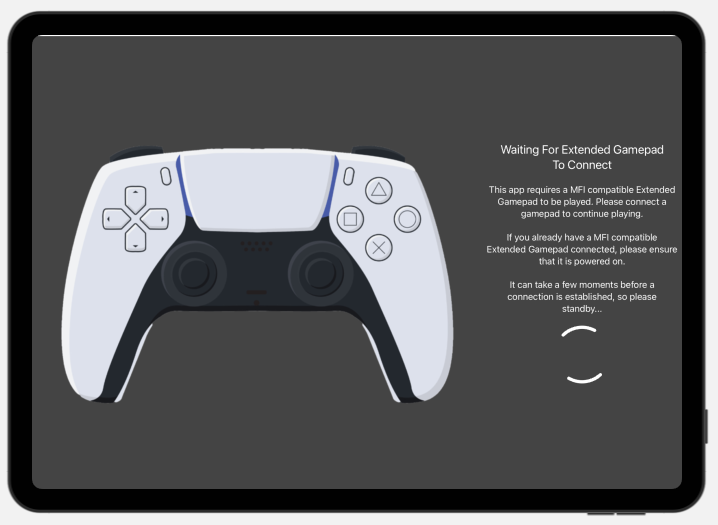
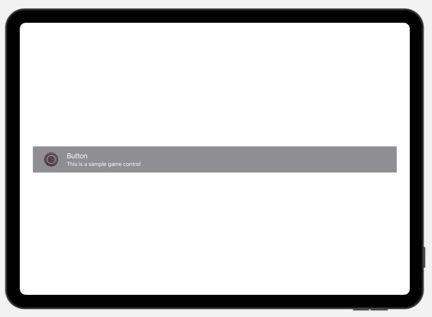

# SwiftUIGamepad

            

`SwiftUIGamepad` makes it easy to add Gamepad support to any `SwiftUI View`.

## Overview

Using `SwiftUIGamepad` you can easily add Gamepad support to any `SwiftUI` based app. `SwiftUIGamepad` provides a built-in set of Gamepad images and support for showing a help overlay based on the way the Gamepad is being used in any `View`. `SwiftUIGamepad` also provides support for Gamepads attaching/detaching from the Device and has an overlay when the App requires a Gamepad to work.

### Enabling Gamepad Support

Before you can use a Gamepad in your Swift App, you need to enable support. In Xcode, select your App's **Project** > **Signing & Capabilities** > **+ Capability** and add **Game Controllers**:



Once enabled, select the types of Gamepads that you want to support from the list of checkboxes.

* **Extended Gamepad** - These are game controller like PS4, PS5 and Xbox gamepads. This is the main type of gamepad that the package was designed to support.
* **Micro Gamepad** - This is the Apple TV Siri Remote that can act like a tiny gamepad. 
* **Directional Gamepad** - A small gamepad that has a D-Pad and A & B Buttons only. 

> If you have **Micro Gamepad** enabled, it can keep the Apple TV from recognizing that an **Extended Gamepad** has connected. If you are using this package in a tvOS app, I suggest disabling it.

### Responding to Gamepad Events

By importing `SwiftUIGamepad` into a SwiftUI `View` definition, it will get several new events that you can respond to as the user interacts with the gamepad and it connects to or disconnects from the device the app is running on.

> For `SwiftUIGamepad` to function, you **must** add the `GamepadManager` events to the app's `.onChange` event. See the **Where To Set The Style Changes and Wire-Up Gamepad Support** documentation below for full details.

For example, let's take a look at the `body` of an About View:

```
@State var showGamepadHelp:Bool = false
@State var isGamepadConnected:Bool = false
    
 var body: some View {
    mainContents()
    .onAppear {
        connectGamepad(viewID: "About", handler: { controller, gamepadInfo in
            isGamepadConnected = true
            buttonMenuUsage(viewID: "About", "Return to the **Cover Page Menu**.")
            buttonAUsage(viewID: "About", "Show or hide **Gamepad Help**.")
        })
    }
    .onDisappear {
        disconnectGamepad(viewID: "About")
    }
    .onRotate { newOrientation in
        Execute.onMain {
            orientation = newOrientation
        }
    }
    .onGampadAppBecomingActive(viewID: "About") {
        reconnectGamepad()
    }
    .onGamepadDisconnected(viewID: "About") { controller, gamepadInfo in
        isGamepadConnected = false
    }
    .onGamepadButtonMenu(viewID: "About") { isPressed in
        if isPressed {
            // Return to main menu ...
        }
    }
    .onGamepadButtonA(viewID: "About") { isPressed in
        if isPressed {
            showGamepadHelp = !showGamepadHelp
        }
    }
    .onGamepadLeftShoulder(viewID: "About") { isPressed, value in
        if isPressed {
            // Return to main menu ...
        }
    }
}
```

The next sections will look at this code in detail.

#### Requesting View Gamepad Access

The first thing to note is when the `View` appears we ask it to request access to any gamepad attached to the device the app is running on:

```
.onAppear {
    connectGamepad(viewID: "About", handler: { controller, gamepadInfo in
        isGamepadConnected = true
        buttonMenuUsage(viewID: "About", "Return to the **Cover Page Menu**.")
        buttonAUsage(viewID: "About", "Show or hide **Gamepad Help**.")
    })
}
```

> The `viewID` property used in all `SwiftUIGamepad` controls and events in highly important and **must be unique** for every view in your app. Failure to provide a unique `viewID` will result in unpredictable behavior in your app and can have the wrong `View` respond to the wrong event or fail to respond to gamepad events at all.
> 
> Additionally, all `SwiftUIGamepad` controls on the same `View` **must** use the same `viewID` property.

If gamepad access is established, we set a state variable and provide user **Help** descriptions for the gamepad controls the `View` responds to. 

You can use the `GamepadHelpOverlay` view to display standardized help inside of your app as follows:

```
if showGamepadHelp {
    GamepadHelpOverlay()
}
```



The entries that you've added using functions like `buttonMenuUsage` or `buttonAUsage` will be displayed here.

Additionally, if your app required a gamepad to work, you can use the standardized `GamepadRequiredOverlay` to request that the user connect a gamepad before continuing:

```
if !isGamepadConnected {
    GamepadRequiredOverlay()
}
```



#### Gamepad Connection Events

Your `View` should respond to a gamepad connecting or disconnecting from the device the app is running on at any time. Use the `onGampadAppBecomingActive` event:

```
.onGampadAppBecomingActive(viewID: "About") {
    reconnectGamepad()
}
```

The call to `reconnectGamepad` function ensures the `connectGamepad` event is call again when the app wakes from being in the background.

To handle the gamepad disconnecting from the app use:

```
.onGamepadDisconnected(viewID: "About") { controller, gamepadInfo in
    isGamepadConnected = false
}
```

#### Responding to User Input via Gamepad

There are several different types of events that a `View` can respond to as the user interacts with a gamepad's controls (such as pressing the A Button or pulling the Right Trigger). For example:

```
.onGamepadButtonMenu(viewID: "About") { isPressed in
    if isPressed {
        // Return to main menu ...
    }
}
.onGamepadButtonA(viewID: "About") { isPressed in
    if isPressed {
        showGamepadHelp = !showGamepadHelp
    }
}
.onGamepadLeftShoulder(viewID: "About") { isPressed, value in
    if isPressed {
        // Return to main menu ...
    }
}
```

In our example About View, pressing the gamepad's **Left Shoulder Button** or **Menu Button** will return the user to the app's Main Menu. While pressing the **A Button** will show or hide the **Gamepad Help Overlay**.

> See **Extended Modules** > **SwiftUI** > **Extended Protocols** > **View** in the DocC Documentation for a full list of gamepad `View Events` and their usage.

#### Displaying Gamepad Control Tips

The `GamepadControlTip` control can be used to display quick help to the app's user. For example:

```
GamepadControlTip(iconName: GamepadManager.gamepadOne.gampadInfo.buttonAImage, title: "Help", scale: ScreenMetrics.controlButtonScale, enabledColor: Color("HUDForeground"))
```



In this example `GamepadManager.gamepadOne.gampadInfo.buttonAImage` will get the correct image for the **A Button** based on which type of gamepad (PS4, PS5, Xbox, etc.) the user has connected to the device.

> See the `GamePadInfo` class for the full information you can get about the attached gamepad.

#### Releasing Gamepad Access

When a `View` is done accessing a gamepad, it needs to release its access using:

```
.onDisappear {
    disconnectGamepad(viewID: "About")
}
```

### Embedded Sounds

There are two default sounds embedded in `SwiftUIGamepad` for use in the `GamepadMenuView` control:

* [diamond-click.mp3](https://freesound.org/people/MATRIXXX_/sounds/703884/) - Used when a menu item gets focus.
* [mouse-click.mp3](https://freesound.org/people/MATRIXXX_/sounds/365648/) - Used when the menu item is clicked/selected.

Both sounds were sourced from [Freeound.org](https://freesound.org) under the Creative Commons 0 License.

### Embedded Image

There are several Gamepad images embedded in `SwiftUIGamepad` that can be used to display help for the users. Images are provided for the following controllers:

* **PS4**
* **PS5**
* **XBox**
* **Generic Gamepad**
* **Siri Remote v1**
* **Siri Remote v2**

All images are released under the **Creative Commons 0 License**.

### The SwiftUIGamepad Class

The `SwiftUIGamepad` provides a few helper utilities that allow you to easily access resources stored in the Swift Package (such as the images above).

For example, the following code would return the path to the `xxx.png` file:

```
let path = SwiftUIGamepad.pathTo(resource:"xxx.png")
```

### Default Control Settings

Several of the controls defined in `SwiftUIGamepad` have a static set of properties to control all instances of any control created without specifying those properties.

For example, the `GamepadMenu` defines:

```
/// Defines the default card font for the `GamepadMenu` view.
public static var gameMenuCardFontName:String = "Arial"
    
/// Defines the default card font size for the `GamepadMenu` view.
public static var gameMenuCardFontSize:Float = 24
    
/// Defines the default card font color for the `GamepadMenu` view.
public static var gameMenuCardFontColor:Color = .white
    
/// Defines the default card background color for the `GamepadMenu` view.
public static var gameMenuCardBackground:Color = .blue
```

If you wanted to universally style all of the `GamepadMenuCardView` instances used throughout you App, simply adjust the `gameMenuCardBackground` of `SwiftUIGamepad`:

```
SwiftUIGamepad.gameMenuCardBackground = .red
```

Now all new `GamepadMenuCardView` items created will have a `red` background.

### Where To Set The Style Changes and Wire-Up Gamepad Support

For style changes to be in effect, you'll need to make the changes before any `Views` are drawn. You can use the following code on your main app:

```
import SwiftUI
import SwiftletUtilities
import LogManager
import SwiftUIKit
import SwiftUIGamepad

@main
struct PackageTesterApp: App {
    @UIApplicationDelegateAdaptor private var appDelegate: AppDelegate
    @Environment(\.scenePhase) private var scenePhase
    @Environment(\.colorScheme) var colorScheme
    
    var body: some Scene {
        WindowGroup {
            ContentView()
        }
        .onChange(of: scenePhase) { oldScenePhase, newScenePhase in
            switch newScenePhase {
            case .active:
                Debug.info(subsystem: "PackageTesterApp", category: "Scene Phase", "App is active")
                
                // Start watching for Gamepads being connected
                GamepadManager.startWatchingForGamepads()
                
                // Inform any gamepad views that the app is becoming active
                GamepadManager.gamepadOne.appIsBecomingActive()
            case .inactive:
                Debug.info(subsystem: "PackageTesterApp", category: "Scene Phase", "App is inactive")
                
                // Inform any gamepad views that the app is becoming inactive
                GamepadManager.gamepadOne.appIsBecomingInactive()
            case .background:
                Debug.info(subsystem: "PackageTesterApp", category: "Scene Phase", "App is in background")
                
                // Stop watching for gamepads
                GamepadManager.stopWatchingForGamepads()
                
                // Inform any gamepad views that the app is entering the background
                GamepadManager.gamepadOne.appIsEnteringBackground()
            @unknown default:
                Debug.notice(subsystem: "PackageTesterApp", category: "Scene Phase", "App has entered an unexpected scene: \(oldScenePhase), \(newScenePhase)")
            }
        }
    }
}

/// Class the handle the event that would typically be handled by the Application Delegate so they can be handled in SwiftUI.
class AppDelegate: NSObject, UIApplicationDelegate {
    
    /// Handles the app finishing launching
    /// - Parameter application: The app that has started.
    func applicationDidFinishLaunching(_ application: UIApplication) {
        // Register to receive remote notifications
        UIApplication.shared.registerForRemoteNotifications()
    }
    
    /// Handle the application getting ready to launch
    /// - Parameters:
    ///   - application: The application that is going to launch.
    ///   - launchOptions: Any options being passed to the application at launch time.
    /// - Returns: Returns `True` if the application can launch.
    func application(_ application: UIApplication, willFinishLaunchingWithOptions launchOptions: [UIApplication.LaunchOptionsKey : Any]? = nil) -> Bool {
        // Set any `SwiftUIGamepad` global style defaults here before any `Views` are drawn.
        // Set style defaults
        SwiftUIGamepad.gameMenuCardBackground = .red
        return true
    }
    
    /// Handles the app receiving a remote notification
    /// - Parameters:
    ///   - application: The app receiving the notifications.
    ///   - userInfo: The info that has been sent to the App.
    func application(_ application: UIApplication, didReceiveRemoteNotification userInfo: [AnyHashable : Any]) {
        
    }
}
```

With this code in place, make any style changes in `func application(_ application: UIApplication, willFinishLaunchingWithOptions launchOptions: [UIApplication.LaunchOptionsKey : Any]? = nil) -> Bool` and they apply to all views built afterwards.

> For `SwiftUIGamepad` to function, you **must** add the `GamepadManager` events to the app's `.onChange` event (as listed above). Currently `SwiftUIGamepad` only supports one gamepad being connected at a time, it will be available in the `GamepadManager.gamepadOne` property.

# Documentation

The **Package** includes full **DocC Documentation** for all of Grace's features.
